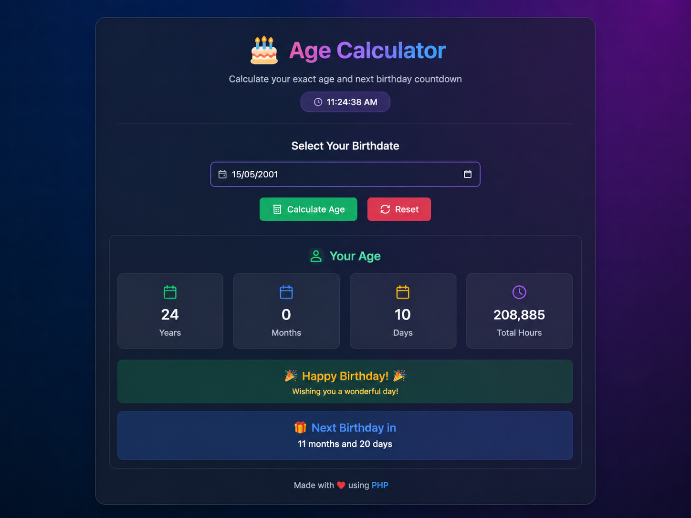

# 🎂 Advanced Age Calculator

A modern and interactive **Age Calculator Web Application** built using **PHP, HTML, CSS, and JavaScript**.

This project calculates the user's exact age in:

- Years
- Months
- Days
- Total Hours

It also includes:

- 🎉 Birthday detection
- 🎁 Next birthday countdown
- 🕒 Live digital clock
- 🌈 Modern responsive interface
- 🔄 Reset button
- ⚠️ Future date validation

---

# 🚀 Technologies Used

- HTML5
- CSS3
- JavaScript
- PHP

---

# 📂 Project Structure

```bash
Age-Calculator/
│
├── index.php
├── README.md
└── screenshot.png
```

---

# 🖥️ Interface Screenshot



---

# ✨ Features

## ✅ Exact Age Calculation
Calculates age in years, months, and days.

## ✅ Live Clock
Shows real-time digital clock using JavaScript.

## ✅ Birthday Detection
Displays a birthday message if today matches the user's birth date.

## ✅ Next Birthday Countdown
Shows remaining months and days until the next birthday.

## ✅ Responsive Design
Works on desktop, tablet, and mobile devices.

## ✅ Modern UI
Uses glassmorphism design with gradient background.

---

# ⚙️ How to Run the Project

## 1️⃣ Install XAMPP
Download and install XAMPP.

## 2️⃣ Move Project Folder
Copy the project folder into:

```bash
htdocs/
```

Example:

```bash
C:/xampp/htdocs/Age-Calculator
```

## 3️⃣ Start Apache
Open XAMPP Control Panel and start:

- Apache

## 4️⃣ Open in Browser

```bash
http://localhost/Age-Calculator
```

---

# 📸 How to Add Screenshot

1. Open your project in browser.
2. Take screenshot using:
   - Windows: `Win + Shift + S`
3. Save image as:

```bash
screenshot.png
```

4. Place it inside your project folder.

---

# 🔮 Future Improvements

- Dark/Light mode
- Save age history
- Zodiac sign feature
- Animated birthday effects
- Multi-language support

---

# 👩‍💻 Author

Developed by D.

---

# ⭐ Project Idea

This project is good for:

- PHP beginners
- Web development practice
- University mini projects
- Portfolio projects

---

# 📜 License

Free to use for learning and educational purposes.
